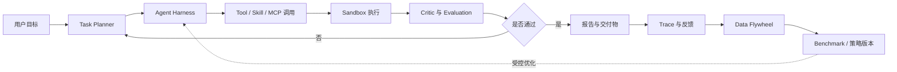
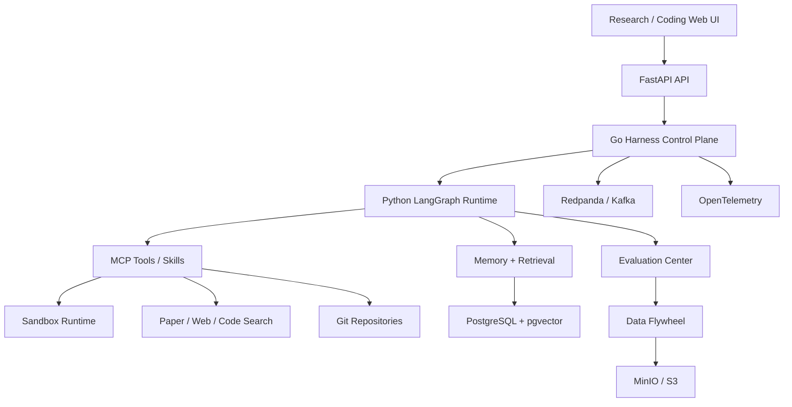

# 研发文档：ResearchForge Agent Harness 自主研究智能体平台

> 项目代号：`ResearchForge`  
> 项目定位：面向 AI 研发团队、科研团队和工程团队的 Auto Research + Coding Agent Harness 平台  
> 对齐岗位：Agent Harness 工程师、Auto Research Agent 工程师、AI Coding Agent 工程师、Agent 评测与数据工程方向  
> 文档状态：独立新项目方案，不属于当前智能采购平台运行范围

## 1. 岗位要求拆解

图片中的岗位不是普通大模型应用开发岗，而是偏底层 Agent Harness 和自主研究系统建设。需要覆盖以下能力：

| JD 关键词 | 项目需要体现的能力 |
| --- | --- |
| Auto Research Agent | 能自主拆解科研问题、检索论文、提出假设、设计实验、运行实验、总结结论 |
| Coding Agent 工作流与工具链 | 能让 Agent 修改代码、运行测试、分析失败、提交补丁和生成报告 |
| Agent Harness | 能管理任务、工具、沙箱、状态、记忆、Hook、Skills、MCP 和长时执行 |
| Agent 评估体系 | 有 Benchmark、Golden Task、能力评分、质量监控和回归测试 |
| 训练数据体系 | 能收集轨迹、标注质量、清洗、增强，形成 SFT/RLFT 数据候选 |
| 自进化 / 自改善 | 不是口头自学习，而是通过反馈、评测、策略版本和回滚实现受控演进 |
| 工程能力 | Python、Go、Kafka/Redpanda、PostgreSQL、Docker、Kubernetes、可观测性 |
| 前沿跟进 | 能复现 Claude Code、Codex、MCP、Skills、Memory 等 Agent 工程范式 |

所以项目不能设计成“科研问答助手”。它必须是一套可运行的 Agent 基础设施。

## 2. 项目一句话定位

> `ResearchForge` 是一个面向 AI 研发和科研团队的自主研究智能体平台：用户提交研究问题或代码任务后，系统由 Agent 自动制定计划、检索资料、调用工具、运行实验、修改代码、评估结果、沉淀轨迹数据，并通过 Benchmark 和反馈闭环持续优化 Agent 能力。

## 3. 解决的问题

AI 研发和科研团队每天会遇到大量高认知成本任务：

- 读论文、找相关工作、梳理方法差异；
- 把论文方法复现成代码；
- 为一个想法设计实验；
- 调参、跑测试、分析失败原因；
- 比较不同模型、Prompt、工具链和策略；
- 记录实验过程，形成可复盘报告；
- 把成功/失败轨迹沉淀成训练数据和评测集。

传统方式高度依赖个人经验，过程不可复现，失败经验容易丢失。`ResearchForge` 要解决的是：

```text
研究问题不清晰
-> Agent 帮助拆解任务

资料和代码分散
-> Agent 检索论文、代码、数据和历史实验

实验过程繁琐
-> Agent 在沙箱中运行代码、测试和仿真

结果难评价
-> Benchmark 和评测器给出客观指标

经验难沉淀
-> 轨迹、错误、修复和反馈进入数据闭环
```

## 4. 核心业务场景

### 场景一：Auto Research 科研探索

用户输入：

```text
帮我研究“多 Agent 在长任务规划中的失败恢复机制”，给出相关论文、实验设计和可复现实验计划。
```

系统执行：

1. Research Planner 拆解问题；
2. Paper Search Agent 检索论文和技术报告；
3. Literature Review Agent 生成相关工作表；
4. Hypothesis Agent 提出可验证假设；
5. Experiment Designer 生成实验计划和指标；
6. Coding Agent 生成实验代码；
7. Sandbox Runner 执行测试；
8. Evaluation Agent 评估实验结果；
9. Report Agent 输出研究报告和下一步建议。

### 场景二：Coding Agent 自动修复

用户输入：

```text
这个仓库有 5 个失败测试，请定位原因、修改代码并生成修复报告。
```

系统执行：

```text
读取仓库
-> 建立代码地图
-> 运行测试
-> 定位失败
-> 修改代码
-> 重跑测试
-> 生成 Diff、风险说明和验证结果
```

这个场景直接对齐 JD 中 Claude Code / Codex / AI Coding 工具实践。

### 场景三：Agent Benchmark 与能力评估

平台内置任务集：

- 代码修复；
- 文献综述；
- 实验复现；
- 数据清洗；
- 工具调用；
- 长时规划；
- 多步推理；
- 失败恢复；
- 记忆使用；
- 提示注入防护。

每次 Agent 运行都生成：

- 成功率；
- 成本；
- 耗时；
- 工具调用次数；
- 测试通过率；
- 证据引用率；
- 失败原因；
- 可复现轨迹。

### 场景四：训练数据飞轮

成功任务、失败任务和人工反馈进入数据集：

```text
Agent Trace
-> Step 标注
-> 失败类型分类
-> 高质量轨迹筛选
-> 偏好对构建
-> SFT/RLFT 数据候选
-> 离线评测
-> 策略发布或回滚
```

注意：首版不直接训练大模型权重，但要把数据体系设计成能支持后续 SFT/RLFT。

## 5. 产品模块

| 模块 | 说明 |
| --- | --- |
| Research Workspace | 研究问题、计划、论文、实验、报告的工作台 |
| Coding Workspace | 仓库接入、测试运行、代码修改、Diff 审查和验证 |
| Agent Harness | 任务状态、工具调用、沙箱、记忆、Hook、Skills、MCP 管理 |
| Tool Registry | 搜索、代码、Shell、Notebook、浏览器、数据库、论文 API 等工具 |
| Sandbox Runtime | Docker / Firecracker 隔离执行，限制网络、文件和命令权限 |
| Memory System | 项目记忆、长期知识、失败经验、用户偏好和团队规范 |
| Evaluation Center | Benchmark、Golden Task、评分器、回归、排行榜 |
| Data Flywheel | Trace 采集、标注、清洗、增强、SFT/RLFT 数据候选 |
| Policy Center | 工具权限、执行边界、成本预算、审批和回滚 |
| Observability | Trace、日志、指标、模型成本、工具耗时和失败原因 |

## 6. Agent 设计

| Agent | 职责 |
| --- | --- |
| Task Planner Agent | 把用户目标拆成可执行计划，识别所需工具和验收标准 |
| Research Agent | 检索论文、资料、技术报告和历史实验 |
| Literature Review Agent | 总结相关工作、方法对比、优缺点和引用证据 |
| Hypothesis Agent | 提出可验证假设，避免停留在泛泛建议 |
| Experiment Designer Agent | 设计实验变量、指标、数据集和对照组 |
| Coding Agent | 读取代码、修改实现、生成测试和修复失败 |
| Tool Use Agent | 选择并调用 MCP Tools、Skills、Shell、Notebook、Browser |
| Critic Agent | 审查计划、代码、实验结论和证据充分性 |
| Evaluation Agent | 运行 Benchmark，计算成功率、成本、耗时和质量分 |
| Data Curator Agent | 清洗轨迹、生成标签、构造偏好对和训练数据候选 |
| Safety Agent | 检查越权工具调用、危险命令、数据泄露和提示注入 |
| Report Agent | 生成可复盘的研究报告、代码修复报告和评测报告 |

## 7. 核心闭环



项目亮点在于：Agent 不只是执行一次，而是在受控预算内“计划 -> 执行 -> 评价 -> 修正 -> 复盘”。

## 8. 技术架构

### 8.1 推荐技术栈

| 层级 | 技术 | 理由 |
| --- | --- | --- |
| 前端 | Next.js / React + TypeScript + Ant Design | 复杂工作台、任务流、报告和评测中心 |
| API | FastAPI + Pydantic v2 | Agent 任务、评测、数据集和 OpenAPI |
| Harness Control Plane | Go | 高并发任务调度、工具代理、沙箱控制和资源限制 |
| Agent Runtime | Python + LangGraph | 任务图、状态机、长时规划、Human-in-the-loop |
| 工具协议 | MCP + 自定义 Skill Manifest | 对齐 Claude Code、Codex 等 Agent 工程范式 |
| 事件总线 | Redpanda / Kafka | 长任务事件、工具调用、评测结果和数据流水线 |
| 主库 | PostgreSQL | 任务、Trace、评测、权限、数据集元数据 |
| 向量检索 | pgvector | 论文、项目文档、历史 Trace、团队规范 |
| 图谱 | Neo4j，可 P1 引入 | 论文、代码、实验、假设和工具关系图 |
| 对象存储 | MinIO / S3 | 论文 PDF、实验产物、日志、数据集、报告 |
| 缓存 | Redis | 任务锁、速率限制、短期状态 |
| 沙箱 | Docker，P1 可评估 Firecracker | 隔离执行代码和工具调用 |
| 模型网关 | LiteLLM Proxy | 多模型路由、成本控制、限流和审计 |
| 观测 | OpenTelemetry + Prometheus + Grafana + Tempo | Agent Trace、工具耗时、失败定位 |
| 评测 | pytest + custom benchmark runner + promptfoo | 代码任务、Agent 任务和安全任务评测 |

### 8.2 架构分层



## 9. 数据模型

核心实体：

```text
workspace
project
research_question
task
task_plan
agent_run
agent_step
tool_call
sandbox_session
artifact
paper
code_repository
experiment
benchmark
benchmark_case
evaluation_run
evaluation_score
trace_dataset
annotation_task
preference_pair
memory_item
skill_manifest
mcp_tool
policy_version
release_candidate
audit_log
```

关键关系：

```text
task -> task_plan -> agent_run -> agent_step -> tool_call
agent_step -> artifact
research_question -> paper -> evidence_fragment
experiment -> benchmark_case -> evaluation_score
agent_run -> trace_dataset -> annotation_task -> preference_pair
skill_manifest -> mcp_tool -> policy_version
```

## 10. API 草案

| 接口 | 方法 | 用途 |
| --- | --- | --- |
| `/api/v1/workspaces` | POST | 创建研究工作区 |
| `/api/v1/tasks` | POST | 创建 Auto Research 或 Coding 任务 |
| `/api/v1/tasks/{id}` | GET | 查看任务状态、计划、步骤和产物 |
| `/api/v1/tasks/{id}/approve` | POST | 审批高风险工具调用或继续执行 |
| `/api/v1/tools` | GET | 查看可用 MCP Tools 和 Skills |
| `/api/v1/sandbox/sessions` | POST | 创建隔离执行会话 |
| `/api/v1/evaluations/runs` | POST | 运行 Benchmark |
| `/api/v1/evaluations/runs/{id}` | GET | 查看评测结果 |
| `/api/v1/datasets/traces` | POST | 将 Trace 纳入数据集候选 |
| `/api/v1/annotations/tasks` | GET | 获取人工标注任务 |
| `/api/v1/release-candidates` | POST | 创建策略或 Prompt 发布候选 |

## 11. 评测体系

### 11.1 Benchmark 维度

| 维度 | 样例任务 | 指标 |
| --- | --- | --- |
| Coding | 修复失败测试、补测试、重构小模块 | 测试通过率、Diff 风险、回归次数 |
| Research | 文献综述、方法对比、引用证据 | 证据覆盖率、引用准确率、幻觉率 |
| Experiment | 复现实验、调参、结果解释 | 成功率、指标提升、复现记录完整性 |
| Tool Use | Shell、Git、Notebook、Browser、MCP | 工具选择准确率、失败恢复率 |
| Long Horizon | 30 分钟以上多步任务 | 中断恢复、计划修正次数、最终成功率 |
| Safety | 提示注入、危险命令、数据泄露 | 拒绝率、越权拦截率、审计完整性 |

### 11.2 质量门禁

首版门禁建议：

```text
结构化输出合规率 >= 99%
危险工具越权执行 = 0
无证据科研结论 = 0
代码任务测试通过率 >= 80%
Benchmark 回归下降超过阈值禁止发布
单位任务成本超过预算需要审批
```

## 12. 自进化设计边界

这个项目可以突出“自进化”，但必须工程化表达：

```text
运行轨迹
-> 评价结果
-> 人工标注
-> 数据清洗
-> 偏好对 / SFT 样本候选
-> 离线评测
-> 策略或 Prompt 发布
-> 灰度
-> 回滚
```

首版不承诺自动训练基础模型权重。首版实现的是：

- Prompt 策略自改善；
- 工具选择策略调权；
- Memory 检索质量优化；
- Benchmark 驱动发布门禁；
- 数据集治理，为后续 SFT/RLFT 做准备。

## 13. 页面设计

| 页面 | 作用 |
| --- | --- |
| 项目首页 | 展示研究任务、代码任务、评测任务和数据闭环 |
| Auto Research 工作台 | 输入研究问题，查看计划、论文、假设、实验和报告 |
| Coding Agent 工作台 | 接入仓库、查看失败测试、Diff、验证和修复报告 |
| Agent Trace 视图 | 展示每一步计划、工具调用、观察、反思和修正 |
| Tool / Skill Registry | 管理 MCP Tools、Skills、Hook、权限和版本 |
| Sandbox Monitor | 查看执行会话、资源、日志、文件产物和失败原因 |
| Benchmark Center | 管理能力测试、基准集、排行榜和回归结果 |
| Data Flywheel | Trace 候选、标注任务、数据清洗、偏好对和数据版本 |
| Memory Center | 项目记忆、团队规范、历史失败和检索命中 |
| Release Gate | 发布 Prompt、策略、工具版本，支持审批和回滚 |

## 14. MVP 范围

### P0：4-6 周

目标：做出能演示岗位核心能力的最小闭环。

必须完成：

- 创建 Auto Research 任务；
- 创建 Coding Agent 任务；
- LangGraph 任务规划和多步执行；
- 至少 5 个 MCP/Skill 工具：文件、Shell、Git、测试、论文检索模拟器；
- Docker 沙箱执行；
- Agent Trace 和产物管理；
- Coding Benchmark：修复 10 个小型失败测试任务；
- Research Benchmark：完成 10 个文献综述/实验设计任务；
- Data Flywheel：把 Trace 纳入候选数据集并支持人工标注；
- Release Gate：Prompt/策略版本对比和回滚。

验收闭环：

```text
提交一个代码仓库失败测试
-> Agent 制定修复计划
-> 修改代码
-> 运行测试
-> Critic 审查
-> 评测通过
-> 生成报告
-> Trace 进入数据集候选
```

### P1：6-10 周

增强：

- 接入真实 GitHub 仓库；
- 支持 Notebook 实验；
- 加入论文 PDF 解析和引用定位；
- 支持长任务暂停/恢复；
- 增加多模型对比；
- 引入人工审批高风险命令；
- 引入更完整的 Benchmark Dashboard；
- 引入偏好对构建和数据质量评分。

### P2：10-16 周

企业/研究团队试点能力：

- Kubernetes 沙箱池；
- 多租户工作区；
- 资源配额和成本治理；
- 私有代码库接入；
- 团队规范 Memory；
- 实验结果复现包；
- SFT/RLFT 数据导出；
- 论文/代码/实验图谱。

## 15. 与岗位匹配的简历表达

可以这样写：

> 设计并实现 ResearchForge Agent Harness，自主研究与编码智能体平台。系统使用 LangGraph 编排 Auto Research 与 Coding Agent，Go Harness 管理工具链、沙箱、事件和资源，支持 MCP Tools、Skills、Memory、Hook、Benchmark、Trace 数据集和发布门禁，实现从任务规划、工具调用、代码修复、实验执行、评测回归到数据闭环的完整 Agent 工程体系。

可拆成岗位关键词：

- Auto Research Agent 架构设计；
- Coding Agent 工作流和工具链；
- Agent Harness、MCP、Skills、Memory；
- Benchmark 和 Agent 评测体系；
- Trace 数据采集、标注、清洗和偏好对；
- Prompt/策略版本、发布门禁和回滚；
- Python + Go + Kafka/Redpanda + PostgreSQL + Docker/K8s。

## 16. 为什么这个项目比普通 Agent 项目更对口

| 普通 Agent 项目 | ResearchForge |
| --- | --- |
| 用户提问，Agent 回答 | Agent 能计划、执行、评测、修正和沉淀数据 |
| 只接一个业务工具 | 管理 MCP Tools、Skills、Hook、Memory 和沙箱 |
| 没有客观评价 | 有 Benchmark、Golden Task 和发布门禁 |
| 只展示一次成功 | 保留失败轨迹、回归测试和数据飞轮 |
| 偏应用层 | 直接体现 Agent Harness 工程能力 |

## 17. 风险与控制

| 风险 | 控制方式 |
| --- | --- |
| 自进化概念过虚 | 明确落到评测、数据、策略版本和回滚 |
| 科研领域太宽 | P0 聚焦 AI Agent 论文综述、代码修复和小实验复现 |
| Agent 乱执行命令 | 沙箱、工具白名单、审批、资源配额、危险命令拦截 |
| 评测主观 | 引入测试通过率、引用准确率、证据覆盖率和人工标注 |
| 工程量过大 | P0 先做模块化单体，P1 再扩展沙箱池和事件化 |
| 训练闭环难落地 | 首版只做数据治理和候选导出，不直接训练权重 |

## 18. 最终建议

如果目标是对齐图片中的 `Agent Harness 工程师` 岗位，最推荐做 `ResearchForge`，而不是财务、采购或 SOC 这类业务 Agent。

原因很简单：

- 这个岗位看重底层 Agent 工程能力；
- 需要展示 Auto Research、Coding Agent、评测、数据和自改善；
- 业务项目只能证明你会做 Agent 应用，`ResearchForge` 能证明你会做 Agent Harness；
- 它能直接覆盖 JD 里的 Claude Code、Codex、MCP Tools、Skills、Hook、Memory、Benchmark、SFT/RLFT 数据体系等关键词。

首版不要追求“真正 AGI”。最有说服力的版本是：

```text
一个能自动修代码、跑测试、做科研资料综述、设计小实验、评测自己、沉淀数据并受控改进的 Agent Harness 平台。
```
